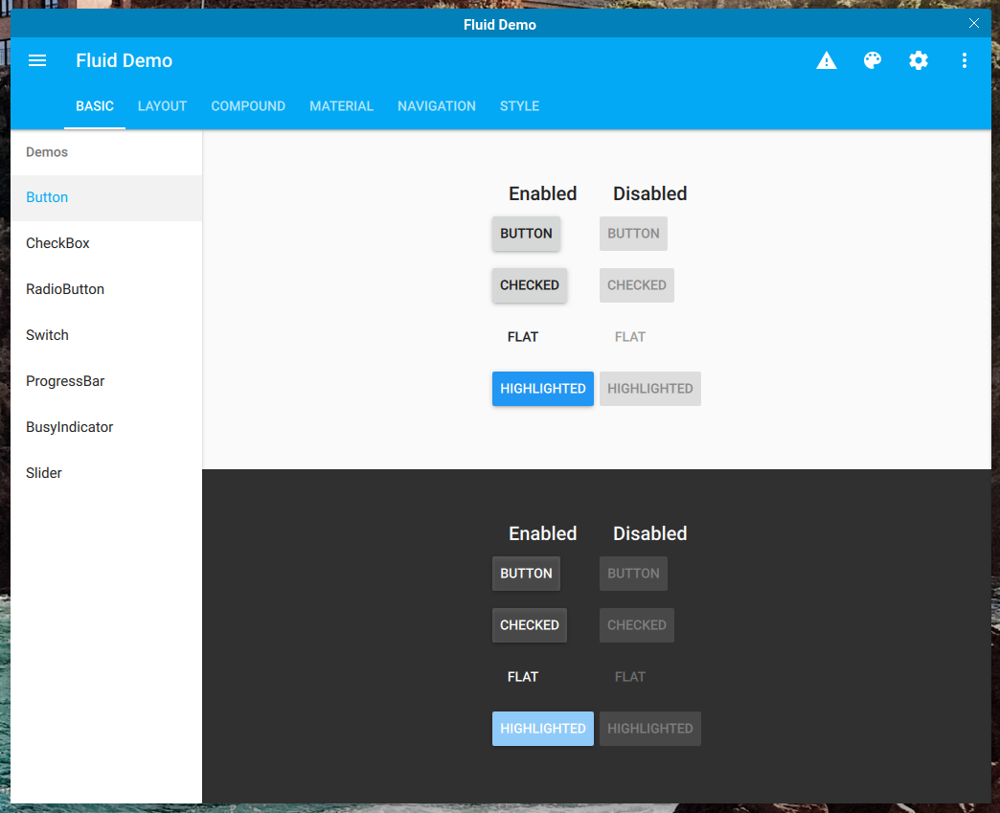

Tulip
=====

[](https://zenhub.io)

[](https://www.mozilla.org/en-US/MPL/2.0/)
[](https://github.com/tulipos/tulip)
[](https://travis-ci.org/tulipos/tulip)
[](https://github.com/tulipos/tulip/issues)
[](https://github.com/tulipos/tulip/commits/develop)

Tulip is a collection of cross-platform QtQuick components for building tulip and dynamic applications,
using the [Material Design](https://material.io/guidelines/) guidelines.

Online documentation is available at [tulip.io](https://tulip.io/docs/sdk/tulip/develop/).

We develop using the [git flow](https://danielkummer.github.io/git-flow-cheatsheet/) method
this means that the `develop` branch contains code that is being developed and might break
from time to time. If you want to check out a stable version just install one of the
releases or clone the `master` branch that has the latest released version.



## Dependencies

Qt >= 5.10.0 with at least the following modules is required:

 * [qtbase](http://code.qt.io/cgit/qt/qtbase.git)
 * [qtdeclarative](http://code.qt.io/cgit/qt/qtdeclarative.git)
 * [qtquickcontrols2](http://code.qt.io/cgit/qt/qtquickcontrols2.git)
 * [qtgraphicaleffects](http://code.qt.io/cgit/qt/qtgraphicaleffects.git)
 * [qtsvg](http://code.qt.io/cgit/qt/qtsvg.git)
 * [qtdoc](http://code.qt.io/cgit/qt/qtdoc.git)

## Build

Qbs is a new build system that is much easier to use compared to qmake or CMake.

If you want to learn more, please read the [Qbs manual](http://doc.qt.io/qbs/index.html),
especially the [setup guide](http://doc.qt.io/qbs/configuring.html) and how to install artifacts
from the [installation guide](http://doc.qt.io/qbs/installing-files.html).

Open up `tulip.qbs` with QtCreator, hit build and run to see the demo in action.

Alternatively you can build it yourself from the terminal.
We strongly advise against manual builds, unless you have previous experience.

**Qbs does not currently support Android builds**, please use per-project installation
if you are building a mobile app.

If you haven't already, start by setting up a `qt5` profile for `qbs`:

```sh
git submodule update --init --recursive
qbs setup-toolchains --type gcc /usr/bin/g++ gcc
qbs setup-qt $(which qmake) qt5 # make sure that qmake is in PATH
qbs config profiles.qt5.baseProfile gcc
```

Then, from the root of the repository, run:

```sh
qbs -d build -j $(nproc) profile:qt5 # use sudo if necessary
```

To the `qbs` call above you can append additional configuration parameters:

 * `modules.tulipdeployment.prefix:/path/to/prefix` where most files are installed (default: `/usr/local`)
 * `modules.tulipdeployment.dataDir:path/to/lib` where data files are installed (default: `/usr/local/share`)
 * `modules.tulipdeployment.libDir:path/to/lib` where libraries are installed (default: `/usr/local/lib`)
 * `modules.tulipdeployment.qmlDir:path/to/qml` where QML plugins are installed (default: `/usr/local/lib/qml`)
 * `modules.tulipdeployment.pluginsDir:path/to/plugins` where Qt plugins are installed (default: `/usr/local/lib/plugins`)
 * `modules.tulipdeployment.qbsModulesDir:path/to/qbs` where Qbs modules are installed (default: `/usr/local/share/qbs/modules`)

See [tulipdeployment.qbs](https://github.com/tulipos/qbs-shared/blob/develop/modules/tulipdeployment/tulipdeployment.qbs)
for more deployment-related parameters.

See also [System-wide installation](#system-wide-installation).

You can also append the following options to the last line:

 * `projects.Tulip.withDemo:false`: Do not build the demo app.
 * `projects.Tulip.withDocumentation:false`: Do not build the documentation.
 * `projects.Tulip.useStaticAnalyzer:true` to enable the Clang static analyzer.
 * `projects.Tulip.useSystemQbsShared:true` to use a system-wide installation of qbs-shared
   instead of the git submodule included here.

Run the demo with (unless `projects.Tulip.withDemo:false`):

```sh
qbs run --no-build -d build --products tulip-demo
```

### Documentation

The HTML documentation is built if `projects.Tulip.withDocumentation:true` is passed
to qbs and it is localed inside `<install root>/<prefix>/share/doc/tulip/html`.

Open `<install root>/<prefix>/share/doc/tulip/html/index.html` with a browser to read it.

## Installation

You can either install system-wide or per-project installation which
is essentially embedding Tulip in your project.

System-wide installations are usually performed by packagers who want
to redistribute Tulip in their Linux distro.

Per-project installation is most useful for mobile developers that
want to build Tulip alongside their project.

## System-wide installation

We assume that your distro installs QtQuick modules in `/usr/lib/qt/qml`
like `Arch Linux` does, please change the paths for your Linux distro.

The same goes for other operating systems.

From the root of the repository, run:

```sh
git submodule update --init --recursive
qbs setup-toolchains --type gcc /usr/bin/g++ gcc
qbs setup-qt /usr/bin/qmake-qt5 qt5
qbs config profiles.qt5.baseProfile gcc
qbs build --no-install -d build profile:qt5 modules.tulipdeployment.prefix:/usr modules.tulipdeployment.qmlDir:/usr/lib/qt/qml
sudo qbs install -d build --no-build -v --install-root / profile:qt5
```

Please note that a system-wide installation is discouraged in most cases
because there's a risk to "pollute" your system with libraries not
managed by a package manager.

## Per-project installation

You can embed Tulip in your project and build it along your app.

We have an example with qmake in `examples/perproject/minimalqmake`
and another one for qbs in `examples/perproject/minimalqbs`.

## Licensing

Licensed under the terms of the Mozilla Public License version 2.0.
